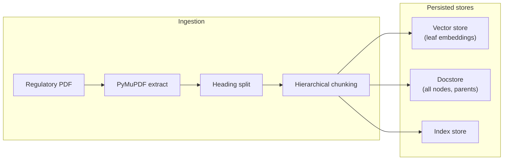

# Governance & Compliance Knowledge Swarm

A retrieval-augmented generation (RAG) foundation aimed at **cross-referencing internal project documents against large regulatory corpora** for compliance checks and remediation hints. This repository currently implements **Phase 1**: ingestion of massive regulatory PDFs, structured metadata, parent–child chunking (parent-document retrieval pattern), and persistence of a vector index plus docstore.

## Goals

- Highly accurate retrieval over long regulations (500+ page PDFs).
- Preserve **Chapter / Article / Section** context in metadata for filtering and grounding.
- Use **parent–document retrieval**: small chunks for precise vector search, larger parent spans for context at generation time.

## High-level architecture



1. **PDF extraction** (`compliance_swarm/pdf_extract.py`): Full text via PyMuPDF; character spans map offsets to **page numbers** for `page_start` / `page_end` metadata.
2. **Structural splitting** (`compliance_swarm/regulatory_split.py`): Lines matching Chapter / Article / Section patterns become boundaries; each segment is a LlamaIndex **Document** carrying shared metadata through downstream chunking.
3. **Parent–child chunking** (`compliance_swarm/ingest.py`): LlamaIndex `HierarchicalNodeParser` builds **parent** nodes (large token budget, ~1000-word equivalent) and **leaf** nodes (small budget, ~200-word equivalent). Only **leaves** are embedded into the vector store; **parent** nodes are stored in the **docstore** so retrieval can expand to parent context using `NodeRelationship.PARENT` / `parent_node_id` on leaves.

Planned or optional extensions (not wired in this repo yet): **Neo4j** for GraphRAG-style entity and obligation mapping, **Pinecone** as a managed vector backend, and a **query / orchestration** layer that compares internal docs to this regulatory index.

## Tech stack

| Layer | Choice |
|--------|--------|
| Language | Python 3.11+ |
| RAG orchestration | LlamaIndex (`llama-index-core`) |
| PDF parsing | PyMuPDF (`pymupdf`) |
| Chunking | `HierarchicalNodeParser` + `SentenceSplitter` (sizes in **tokens**) |
| Embeddings (default) | Sentence Transformers via `llama-index-embeddings-huggingface` (default model: `sentence-transformers/all-MiniLM-L6-v2`) |
| Embeddings (optional) | OpenAI `text-embedding-3-small` via `llama-index-embeddings-openai` |
| Vector store | Simple JSON-backed store (default) or **FAISS** (`--vector-backend faiss`) |

## Prerequisites

- **Python 3.11 or newer**
- For default embeddings: enough disk for Hugging Face model cache (first run downloads the model).
- For **OpenAI** embeddings: an API key in the environment (`OPENAI_API_KEY`) and the optional package below.

## Installation

Clone the repository, create a virtual environment, and install dependencies:

```bash
git clone <repository-url>
cd Governance-Compliance-Knowledge-Swarm
python3.11 -m venv .venv
source .venv/bin/activate   # Windows: .venv\Scripts\activate
pip install -r requirements.txt
```

### Optional dependencies

- **OpenAI embeddings**: `pip install llama-index-embeddings-openai`, then export `OPENAI_API_KEY`.
- **Pinecone**: not integrated in code yet; when added, you would install something like `llama-index-vector-stores-pinecone` and configure your index.

## How to run (ingestion)

Ingest a regulatory PDF and persist LlamaIndex storage (vector store, docstore, index store) under a directory of your choice:

```bash
python -m compliance_swarm.ingest path/to/regulation.pdf --persist-dir storage/regulatory_index
```

Equivalent entry point:

```bash
python -m compliance_swarm path/to/regulation.pdf --persist-dir storage/regulatory_index
```

### Useful CLI options

| Option | Description |
|--------|-------------|
| `--persist-dir` | Output directory (default: `storage/regulatory_index`) |
| `--parent-chunk-tokens` | Parent chunk size in tokens (default: 1300, ~1000 words) |
| `--child-chunk-tokens` | Leaf chunk size in tokens (default: 260, ~200 words) |
| `--chunk-overlap` | Token overlap between chunks (default: 40) |
| `--embeddings huggingface` \| `openai` | Embedding backend |
| `--embedding-model` | Override model name (Hugging Face repo id or OpenAI model id) |
| `--vector-backend simple` \| `faiss` | Vector store implementation |
| `-v` / `--verbose` | Debug logging |

### Cache directories

The ingest pipeline sets, unless already defined:

- `LLAMA_INDEX_CACHE_DIR` → `<repo>/.cache/llama_index`
- `HF_HOME` → `<repo>/.cache/huggingface`

So caches stay inside the project tree by default. Add `.cache/` to `.gitignore` if you do not want caches committed (already ignored in this repo).

## Output layout

After a successful run, `--persist-dir` typically contains files such as:

- Vector embedding data (e.g. `default__vector_store.json` for the simple backend)
- `docstore.json` (includes parent nodes for retrieval-time expansion)
- `index_store.json` and related LlamaIndex persistence artifacts

Load them in application code with LlamaIndex `StorageContext.from_defaults(persist_dir=...)`.

## Project layout

```
compliance_swarm/
  __init__.py
  __main__.py          # delegates to ingest CLI
  pdf_extract.py       # PyMuPDF + page spans
  regulatory_split.py  # Chapter / Article / Section splitting
  ingest.py            # hierarchical parsing, indexing, persist
requirements.txt
```

## Roadmap (short)

- Query-time retriever that merges **leaf hits** with **parent** text from the docstore.
- Ingestion for **internal project documents** and a compliance scoring / suggestion layer.
- Optional **Neo4j** GraphRAG and **Pinecone** for scale-out deployments.

## License

Add a license file when you publish (for example MIT or Apache-2.0).
